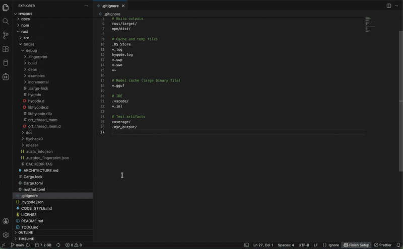
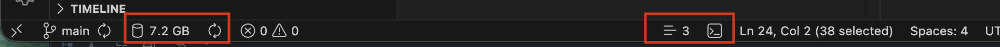

# Termetrix

Minimal VS Code extension for project awareness: **project size**, **guided size breakdown**, **LOC per language**, **selection line counter**, and a **terminal shortcut** — all from the status bar.

## Demo

## Quickstart

1. Open a folder or workspace.
2. Click the metrics item in the status bar to open the Metrics Panel.

## Status Bar

| Item                 | Behavior                                                                                           |
| -------------------- | -------------------------------------------------------------------------------------------------- |
| Terminal button      | Opens the integrated terminal. Can be hidden via settings.                                         |
| Metrics              | Shows total project size. Click to open the Metrics Panel.                                         |
| Refresh / Cancel     | Refreshes the scan on click. Animates while scanning; click again to cancel.                       |
| Selection line count | Shows the number of selected lines. Visible only while selecting text. Can be hidden via settings. |

## Metrics Panel

- **LOC** — approximate lines of code per language with best-effort comment filtering and top files; auto-scans on panel open
- **Size** — total project size with a breakdown of the folders that contribute most to disk usage

## Configuration

All settings are optional. Configurable via `termetrix.*` in VS Code settings.

- `termetrix.statusBar.showTerminalButton` — show/hide the terminal button (default: `true`)
- `termetrix.statusBar.showSelectionLineCount` — show/hide the line counter (default: `true`)
- `termetrix.autoRefresh.enabled` — enable periodic background rescan (default: `false`)
- `termetrix.autoRefresh.minutes` — refresh interval in minutes (default: `10`)
- `termetrix.scan.autoScanMode` — when to auto-scan: `startup+rootChange` | `rootChange` | `off` (default: `startup+rootChange`)
- `termetrix.scan.maxDurationSeconds` — max scan duration before stopping with partial results (default: `10`)
- `termetrix.scan.maxDirectories` — max directories to scan before stopping with partial results (default: `50000`)
- `termetrix.panel.autoScanLoc` — auto-run LOC scan when the panel opens (default: `true`)
- `termetrix.logging.verbose` — verbose logging to output channel (default: `false`)

## Commands

Available in the Command Palette (`Ctrl+Shift+P` / `Cmd+Shift+P`):

- `Termetrix: Open Metrics Panel`
- `Termetrix: Refresh Project Scan`
- `Termetrix: Cancel Scan`
- `Termetrix: Open Terminal`

## Notes

- Project size is a **sum of file sizes** and does not filter by `.gitignore`.
- LOC respects `.gitignore` files at every level of the directory tree and skips common build/deps folders.
- Symlinks are not followed.
- No telemetry, no network requests.

## License

MIT

## Contributing

Contributions are welcome! Please open an issue or pull request.

## Attribution

Insight icon created by [HAJICON](https://www.flaticon.com/authors/hajicon) from [Flaticon](https://www.flaticon.com/free-icons/insight)
